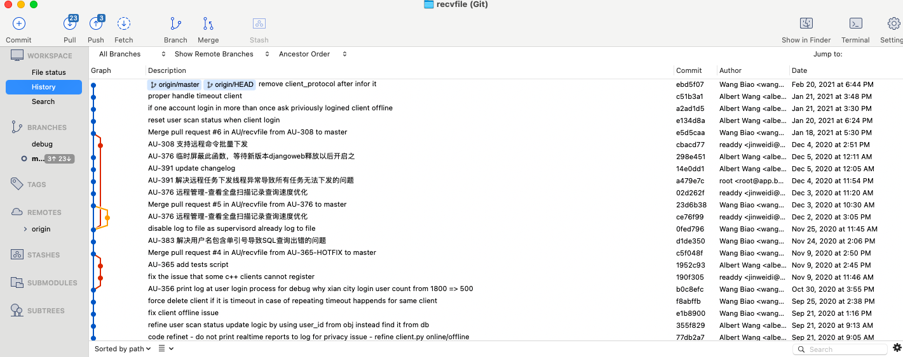
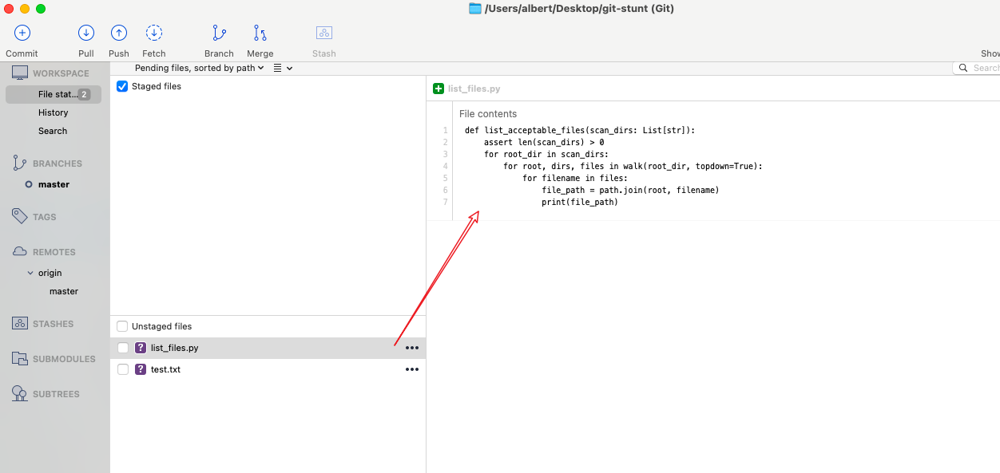

# 如何让 git 用起来得心应手

> 王彪 @2021.4.3 10:40 PM

## 写作背景

> @[x-Long](https://github.com/x-Long) 多次建议我写点git 相关的东西。
>
>  考虑到他总在我编码的时候问我某个操作要用什么命令，又考虑到他陪我喝酒蹦迪，就随便写点东西吧 ^-^

## 为何要好好用 git 

`git` 用的好，一份文件可以精确还原到某次编辑的版本；

`git` 用的好，多人可以同时搞同一个项目；

`git` 用的好，精妙的代码可以方便的分享给全世界的程序员；

`git` 用的好，搬砖轻便又巧妙；

`git` 大法好！


## 零、目标读者

### 0.1 劝退说明

> 掌握以下技能后阅读本文档更佳，否则难以体会本文档的精妙之处。

1. 用过 git 命令行工具
2. 累计编码行数超过 1w 行
3. 在 github 上创建过 repository
4. 知道什么是 ssh 免密登录
5. 知道什么是“家目录”

## 一、工欲善其事，必先利其器

## 1.1 参考工具

#### 1.1.1 sourcetree

- 用途
  - 查看某次提交的详细信息（虽然网页端也可以，但毕竟本地客户端快啊，命令行里哪个浏览

  - 浏览历史提交信息，命令行里查看提交信息缺乏总体可读性

    

  - 提交代码之前，再次验证自己的改动。每次 commit 之前，通过 sourcetree 逐个文件检查自己的变动，确保只将相关代码加入提交。

    

#### 1.1.2 git-bash

##### 1.1.2.1 git-bash 安装说明

windows 系统用git一般都装它，在安装过程有一点要注意，将其加入 `cmd` 的 *PATH*，这样你在 `cmd` 里也可以调用 `git` 命令

`sourcetree` 中代码的推送和拉取有时候存在问题

##### 1.1.2.2 提高 bash 使用效率

在家目录创建如下文件 *.bash_profile* 也可以从 [这里下载](configs/.bash_profile)

```ini
# 注意，路径应该写为这种格式 /d/code/games/thunder_plane
set repo_root=/path/to/repo

# command alias
g=git
alias gc="git checkout"

# 切换到主分支
alias gcm="git checkout master"

# 修改上一次提交信息
alias gamd="git commit --amned"

# (慎用)撤销当前所有修改
alias grst="git reset --hard HEAD"

alias gpl="git pull"
alias gps="git push"

# 一键切换到工作目录
q=cd $repo_root
```

## 1.1.2.3 个性化 git 配制文件

简化 git 命令，下载 [.gitconfig](configs/.gitconfig) 放在你的家目录

```ini
[alias]
  ck = checkout
	mm = commit --amend
	cm = commit -m
	ca = commit -am
	ci = commit
	st = status
	br = branch
	df = diff
	rst = reset --hard
	mg = merge
	mt = mergetool
	# 使用命令 git lg 可以查看更简洁的历史记录
	lg = log --color --graph --pretty=format:'%Cred%h%Creset -%C(yellow)%d%Creset %s %Cgreen(%cr) %C(bold blue)<%an>%Creset' --abbrev-commit

	# 该配置使得每次推送只需要 git push 即可，默认 push 当前 branch 
	# 如果没有该配置，推送代码一般要 git push origin master
[push]
	default = current
```


## 二、git 绝技

### 2.1 修改上一次提交信息

#### 场景 包含不恰当词语的提交
>你心情不好，不小心将 ”解决了鲨凋同事前端验证码输入错误时没有自动更新验证码的bug" 写入到了提交信息中。
>
>写的时候爽了，考虑到如果前端是个玻璃心，人家可能会幽怨。
>
>于是你想修补本次事件，如下命令即可

#### 操作步骤 --amend 的用法

```sh
git commit --amend
# 在随后弹出的编辑器中，手动修改自己的提交信息
```

#### 拓展用法 - 合并后续修改到上一次提交信息中

> amend 这条命令我经常用，但并不是为了修改提交信息。有时候解决完一个问题并做了提交，再看看代码还可以优化.
改吧改吧之后，代码看起来更养眼,此时再做一次提交显得“多余”.
使用 amend 即可将本次修改合并到前一次提交中，有时候我会 amend 五六次。

### 2.2 合并多条提交记录

### 2.3 恢复某个文件到某个特定的版本

### 2.4 找出某行bug是谁写的

### 2.5 显示远程所有分支

### 2.6 多人开发，如何拉取其他人的代码

### 2.6 删除远程分支


